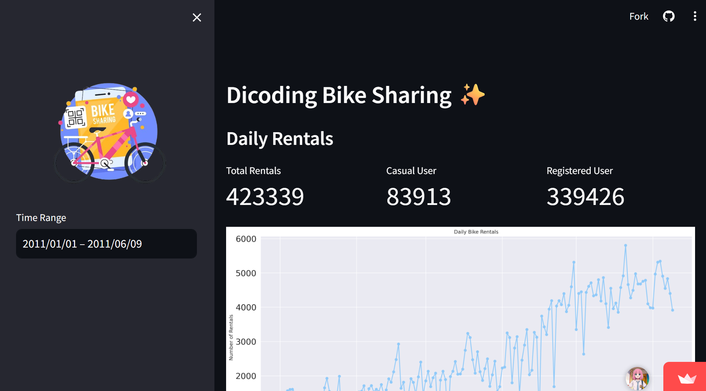

# 🚲 Bike Sharing Dataset Analysis

An end-to-end data analysis project uncovering insights from a bike sharing dataset using Python and Streamlit.

## 📊 Project Summary

This project analyzes a bike sharing dataset to answer key business questions and derive actionable insights. Techniques such as data wrangling, exploratory data analysis (EDA), and data visualization were used to explore trends, user behaviors, and usage patterns.

## 📈 Dashboard

A user-friendly interactive dashboard was created using Streamlit to clearly present the insights from the analysis.



👉 **[Check out the dashboard here](https://submission-bike-sharing.streamlit.app/)**


<h2>🛠️ Installation Steps:</h2>

<p>1. Clone this repository</p>

```
git clone https://github.com/badr-ol/submission-data-analysis.git
```
<p>2. Change directory</p>

```
cd submission-data-analysis
```
<p>3. Create and activate a virtual environment</p>

```
pipenv install
pipenv shell
```
<p>4. Install all the required libraries using the following command.</p>

```
pip install -r requirements.txt
```
<p>5. Go to the dashboard directory and Run the program</p>

```
cd dashboard
streamlit run dashboard.py
```
<p>6. And Voila! streamlit will open a new tab in your browser</p>
